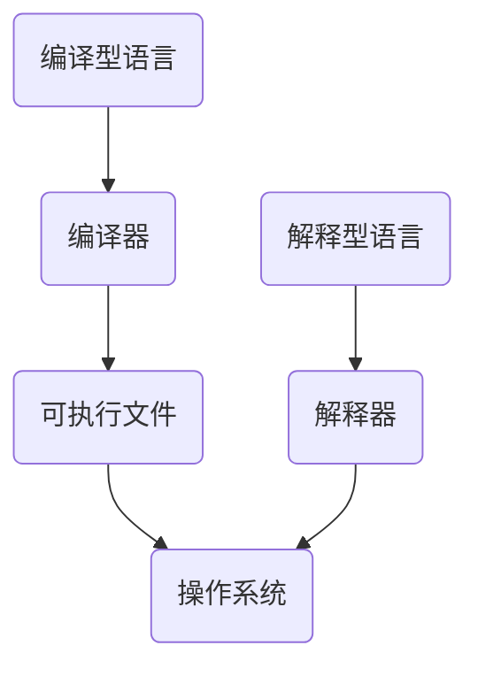
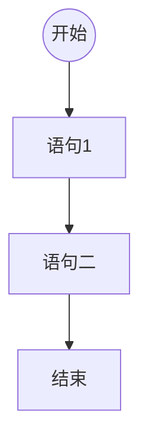
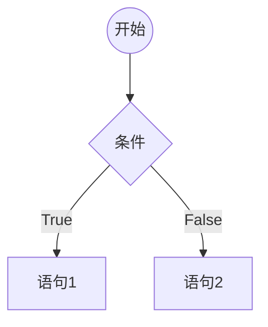
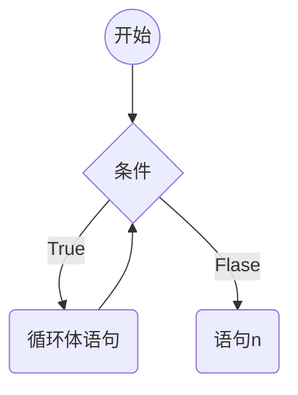
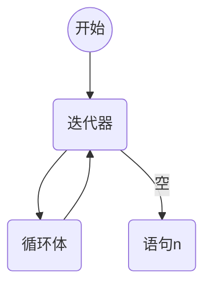
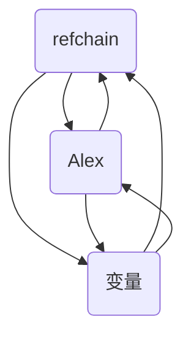
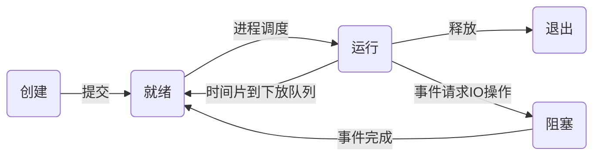

# Python 基础

## 一、初始Python

### 编程语言分类



#### 编译型语言的优缺点

> 1. 一次性编译成平台相关的机器语言,运行时脱离开发环境,运行效率高;
> 2. 与特定平台相关,一般无法移植到其它平台(C、C++、GO)

#### 解释型语言

> 1. 解释型语言每次运行都需要将源码解释为机器码,执行效率低;
> 2. 只需要平台提供对应的解释器,就可以运行源码,易移植

> Cython, Jython, PyPy
>
> Cpython

## 二、Python入门

### 环境管理

以conda为例,[Anaconda](https://www.anaconda.com/download)数据科学工具包(内置了1500+发行库),[Miniconda](https://docs.conda.io/projects/miniconda/en/latest/)提供基础解释器与conda环境

### 换行符

```python
print(1)
print(2)
print(3);print(4)
```

### 注释

```python
# 打印1
print(1)

def add(a, b):
    """
    文档注释: 两数相加(常见于类或函数体注释)
    :param a: 数字1
    :param b: 数字2
    :return: 相加之和
    """
    return a+b
```

### 编码规范(PEP8)

PEP8是Python的官方代码风格指南，旨在提供一致、易于阅读和易于维护的Python代码。PEP 8规范包括以下方面:

> 1. 缩进:使用四个空格表示缩进
> 2. 行长:每行代码不应超过79个字符
> 3. 命名规范:变量名应以小写字母开头，使用下划线分隔多个单词;类名应
>    以大写字母开头，使用驼峰命名法。
> 4. 空格:在运算符两侧、逗号后以及冒号后应添加空格
> 5. 注释:注释应该清晰、简洁，使用英文书写。注释应该说明代码的作用而不是如何实现。
> 6. 函数和类:函数和类之间应该用两个空行分隔。
> 7. 导入:每个导入应该单独成行，避免使用通配符导入
> 8. 括号:在函数调用和定义中，括号内部应该没有空格。

除此之外，PEP 8还涵盖了代码布局、字符串引号、空行、文件编码等方面的规范。
遵守PEP 8规范可以增加代码的可读性和可维护性，这对于团队开发、代码重构和代码维护都非常有帮助。建议Python开发者遵守这些规则，以便与其他Python开发者协作，并使代码更易于理解和维护

### 变量

#### 定义变量

`a = 1`

#### 修改变量

```python
my_value = 1
my_value = 2
```

### 变量类型

#### 整形与浮点型

不可变类型

```python
x = 10
y = 0.56
z = .23
```

#### 字符串

有序的字符集合,存储文本信息,不可变类型

```python
a = '1'
print(type(a))
```

> 转义符
>
> 1. `\'`单引号
> 2. `\"`双引号
> 3. `\\`反斜杠
> 4. `\n`换行
> 5. `\t`制表符
> 6. `\r`回车符

> 格式化输出
>
> ```python
> print('你好,我是%s, 今年%d数, 身高%.2f' % ('李华', 18, 1.68))
> print(f'你好{18}')
> print('你好{}'.format(18))
> ```

#### 布尔型

```python
a = True
b = False
print(type(a), type(b))
```

#### 列表

可变类型

`a = []`

#### 字典

可变类型

`a = {}`

#### 元组

不可变类型

`a = ()`

#### 集合

可变类型

`a = {}`


### 输入输出

```python
print(1)
a = input('输入一个值')
```

### 运算符

```python
1+1
1-1
1*1
1/1
1%1
True and False
True or False
not True
True in [True, False]
```


## 三、Python流程控制语句

### 顺序语句



```python
print(1)
print(2)
```


### 分支语句



```python
a = input("输入一个数字") 
if a == '1':
    # 语句1
    print('你输入了1')
else:
    # 语句2
    print('你输入的不是1')
```


### 循环语句(while)



```python
a = 0
while a < 10:	# 条件
    # 循环体
    a = a + 1
# 语句n
print(a)
```

### 循环语句(for)



```python
a = 0
for i in range(10): # range()迭代器
    # 循环体
    print(i)
    a = a + i
# 语句n
print(a)
```

### 循环退出机制

```python
a = 0
while True:
    a += 1
    if a > 100:
        # 退出上级循环
        break
    elif a > 10:
        # 退出上级 本次 循环
        continue
    a += 2
```

## 四、函数编程

函数是指将一组语句的集合通过一个名字（函数名）封装起来，要想执行这个函数，只需要调用函数名即可。

```python
def my_function(a, b): # 行参
    pass
c = my_function(1, 2) # 实参

def my_function2(a, b=2) # 默认参数
	pass
d = my_funciton2(a=1) # 关键参数

def my_function3(*args, **kwargs): # 非固定参数
    """
    args是所有的匿名参数组成的元组(a, b, c)
    kwargs是所有的关键参数组成的字典{key: value}
    """
    return args # 函数返回值,函数体内执行到return时函数退出并返回对应值
```

## 五、面向对象编程


```python
class MyClass():
    def __new__(cls, *args, **kwargs):
        # new方法执行与__init__之前,new方法不return时init方法不执行
        return object.__new__(cls)
        
    def __init__():
        # 类实例化时调用
        pass
    def _func1(self):
        # 不建议外部直接访问的函数方法
        pass
    def __func2(self):
        # 只允许在类内部调用的方法
        pass
    
    def __len__():
        # 当调用len时被调用
        return 1
    def __doc__():
        # 类的文档
        pass
    
    def __repr__():
        # 调用该对象时调用
        return 'func'
    
    def __str__():
        # 打印时调用
        return 'func'
    
    def __del__():
        # 对象被删除或程序执行完毕时会触发的函数
        pass
    
```

## 六、元类

### 基于类创建对象

```
class Foo(object):
	def __new__(cls, *args, **kwargs):
		return object.__new__(cls)
		
	def __init__(self, name):
		self.name = name
"""
根据类创建对象
	执行类的new方法,创建对象(空对象).[构造方法] {}
	执行类的init方法,初始化对象.[初始化方法] {name: "李华"}
"""
obj = Foo('李华')
```

> 对象是基于类创建的

### 类的创建

> 类默认是由`type`创建的

```python
# 传统方式
class Foo(object):
    v1 = 666
    
    def func(self):
        return 666

# 非传统方式
def do(self):
    return 123

Foo = type('Foo', (object,), {'v1':666, 'func': lambda self: 666, 'do': do})
```

> 元类用于指定类由谁创建, 默认为`type`

```python
# 默认
class Foo(object, metaclass=type):
    pass

# Foo类由MyType创建
class MyType(type):
    pass

class MyFoo(object, metaclass=MyType):
    pass
```

> 类的创建流程
>
> 1. 实例化时会调用类的元类的`__ceil__`方法
> 2. `__ceil__`方法执行`__new__`创建了类和`__init__`实例化了类

```python
class MyType(type):
    def __init__(self, *args, **kwargs):
        super().__init__(*args, **kwargs)

    def __new__(cls, *args, **kwargs):
        new_cls = super().__new__(cls, *args, **kwargs)
        return new_cls

    def __call__(self, *args, **kwargs):
        # 实例加括号时调用
        # 调用当前类的__new__方法去创建对象
        empty_object = self.__new__(self)
        # 调用当前类的__init__方法去实例化对象
        self.__init__(empty_object, *args, **kwargs)
        return empty_object


# 假设Foo是一个对象，由MyType创建
# Foo类其实是MyType的一个对象
# 那么Foo()其实就是MyType().__cell__()
class Foo(object, metaclass=MyType):
    pass


a = Foo()
print(a)
```

### 单例模式

- 方式一：模块导入
- 方式二：并发编程
- 方式三：基于元类的单例模式

```python
class MyType(type):

    def __init__(self, name, bases, attrs):
        super().__init__(name, bases, attrs)
        # 类只会创建一次，在第一次创建时在类里创建一个变量
        self.instance = None

    def __call__(self, *args, **kwargs):
        # 判断当前类是不是第一次创建，如果是则给instance赋值为当前类，下一次再实例化时就不会创建类
        if not self.instance:
            self.instance = self.__new__(self)
        self.__init__(self.instance, *args, **kwargs)
        return self.instance


class Foo(object, metaclass=MyType):
    pass


a = Foo()
b = Foo()
# 此时a和b指向同一个类的实例
print(a == b)

```

## 七、垃圾回收机制

> 引用计数器为主
>
> 标记清除和分代回收未辅

### 引用计数器

#### 环状双向链表(refchain)

> 当前位置可以向上向下查找
>
> 在Python程序中创建的任何对象(不同类型存入的数据大不相同)都会放在refchain链表中




```python
# 不同类型创建的数据不同
# 内部会创建一些数据[上一个对象, 下一个对象, 类型, 引用个数(username应用就变为2)]
name = '李华' 
username = name
age = 18	# 内部会创建一些数据[上一个对象, 下一个对象, 类型, 引用个数, value]
hobby = ['篮球', '音乐']	# 内部会创建一些数据[上一个对象, 下一个对象, 类型, 引用个数, items, 长度]
```

> 在C源码中体现每个对象中都有相同的值:
>
> ​	PyObject结构体[上一个对象, 下一个对象, 类型, 引用个数]
>
> 多个元素组成的对象中:
>
> ​	PyObject(4个值) + ob_size


#### 类型封装的结构体

```python
'''
内部会创建:
	_ob_next = refchain上一个对象
	_ob_prev = refchain下一个对象
	ob_refcnt = 1
	ob_type = float
	ob_fval
'''
data = 3.14
```


#### 引用计数器

```python
v1 = 3,14
v2 = 999
v3 = (1, 2, 3)
```

> Python程序运行时,会根据数据类型的不同找到对应的结构体,根据结构体中的字段进行创建相关的数据,如何将对象添加到`refchain`双向链表中
>
> 在C源码中两个关键的结构体:PyObject、PyVarObject
>
> 每个对象中的ob_refcnt就是计数器，默认值为1，当有其它变量引用时，引用计数器就会发生变化

- 引用

```python
a = 999	# ob_refcnt = 1
b = a	# ob_refcnt = 2
```

- 删除引用

```python
a = 999	# a ob_refcnt + 1
b = a	# a ob_refcnt +1; b ob_refcnt -1
del b # b ob_refcnt -1
del a # a ob_refcnt -1
```

> 垃圾：当引用计数器为0时， 意味着没有人再去使用这个对象，这个对象就会被判定为垃圾
>
> 回收：1.将对象从`refchain`中移除 2.将对象销毁，内存归还

#### 循环引用&交叉感染

```python
v1 = [1, 2, 3] # v1: ob_refcnt = 1
v2 = [4, 5, 6] # v2: ob_refcnt = 1
v1.append(v2)	# v2: ob_refcnt = 2
v2.append(v1)	# v1: ob_refcnt = 1

del v1 # v1: ob_refcnt = 1
del v2 # v2: ob_refcnt = 1
# 此时v1，v2不可再用但是没有释放
```


### 标记清除

> 目的: 为了解决引用计数器循环引用的不足
>
> 实现: 在Python底层又维护了一个双向链表，表中存那些容易循环引用的对象（`list|dict|tupe|set`）
>
> 在Python内部__某种情况下__扫描__循环引用链表__的每个元素，检查是否存在循环引用，如果有则让双方的引用计数器`-1`如果为`0`则标记为垃圾回收

问题？

- 什么时候去扫描
- 链表扫描代价大，耗时久


### 分代回收

> 将可能存在循环引用的对象维护成3个链表:
>
> 每次扫描后不是垃圾的就会提升代数
>
> - 0代：0代中对象个数达到700个扫描一次
> - 1代：0代扫描10次，则1代扫描一次
> - 2代：1代扫描10次，则2代扫描一次

### 小结

> 在Python中维护了一个refchain的双向环状链表，这个链表中存储程序创建的所有对象，每种类型的对象中都有一个ob_refcnt的应用计数器值，被引用和删除是引用计数器的值会随之发生改变，最后当引用计数器的值为0时标记为垃圾进行垃圾回收（对象销毁，从refchain中移除）
>
> 但是，在Python中对于那些有多个元素组成的对象可能出现循环引用的问题，为了解决这个问题Python又引入了标记清除和分代回收，在其内部维护了四个双向环状链表，分别是：
>
> - refchain
> - 0代
> - 1代
> - 2代
>
> 当达到各自的阈值时就会触发扫描链表进行编辑清除动作（有循环引用则引用计数器-1）

### 缓存机制

#### 池(small_ints)（int)

> 为了避免重复的创建和销毁一些常见对象，维护池

```python
# 启动解释器时Python内部会帮我们创建一些常见对象： -5， -4， -3....256
v1 = 2	# 内部不会开辟内存，直接去池中获取
v2 = 3	# 内部不会开辟内存，直接去池中获取
v3 = 3
print(id(v2), id(v3))

v4 = 666	# 开辟内存创建对象
```


#### free_list（float/list/tuple/dict）

> 当一个对象引用计数器为0时，按理是应该回收，内部不会直接回收，而是将都对象添加到free_list链表中当缓存。
>
> 以后再去创建时就不会重新开辟新的内存，而是直接使用free_list中的对象
>
> tuple上限为20，会根据袁术的个数找到对应的上线index存入其中

```python
v1 = 3.14	# 开辟内存，内部存储结构体中定义那几个值，并存入refchain中

del v1	# refchain中移除，将对象添加到free_list中（有上限80个），free_list满了才会进行销毁

v2 = 99.9	# 直接去free_list中获取
```

## 八、并发编程

> 通过代码编程使计算机在一定时间内能同时运行多个程序的编程操作，实现让CPU执行多任务，__并发编程的目的是充分利用CPU，以达到最高的处理性能__
>
> 多任务的实现方式：
>
> - 进程：操作系统资源分配和运行的最小单位
> - 线程：进程内的一个任务执行独立单元，是任务调度和系统执行的最小单位
> - 协程：用户态的轻量级线程，协程调度弯曲由用户控制，重要为了单线程下模拟多线程
>
> 一个程序可以拥有多个进程，每个进程可以用有多个线程，每个线程下可以有多个协程


### 进程

> 组成：
>
> - 程序段：指令集，进程运行的代码段
> - 数据集：数据段，进程执行中向操作系统申请分配的所需要使用的资源
> - 控制块：程序控制块（Program Control Block,，简称PCB），用于记录进程的外部特征，描述进程的执行变化过程，存在系统可以利用它来控制和管理进程，是操作系统感知进程存在的唯一标识
>

#### 进程的标记

> 区分进程的唯一标识PID（Process Identification）
>
> `os.getpid() # 获取当前进程的PID`
>
> `os.getppid() # 获取当前进程的父级的PID`


#### 进程调度

> FCFS调度算法：先到先服务
>
> SJF/SPF调度算法：短作业（短进程调度算法）
>
> PR调度算法：时间片轮转调度算法
>
> MFQ调度算法：多级反馈队列调度算法（目前被公认最优）


#### 并行、并发和串行

> 并行（Parallel），是指多个任务作业在同一时间内分别在各个CPU下执行（多核CPU下才会存在）
>
> 并发（Concurrent），是指在资源有限（单核CPU）的情况下，系统调度只能在同一时间执行一个任务，CPU的控制权在多个任务质检快速的来回切换，因为CPU切换的熟读非常快，使用会造成看起来是同时执行了多个任务的效果。并发在单核CPU和多核CPU都可以存在，看起来是并行，实际是串行
>
> 串行（Serial），是指多个任务在同一时间呢哦CPU只能执行一个任务的作业，第一个执行完之后才会执行第二个


#### 进程的状态

> 在实际开发过程中，往往任务作业的数量远高于CPU核心数，所以程序运行的过程中，由于被操作系统的调度算法控制，程序会静茹以下几个状态：
>
> - 就绪（Ready）：当进程已经分配到除CPU外的所有必要资源，只需要会的处理的机会便可立即执行
> - 运行（Running）：当进程已获得CPU资源，程序正在CPU上执行
> - 堵塞（Blocked）：正在执行的进程，由于某个IO事件（网络请求、文件读写、input、sleep等）发生而无法执行时，便放弃对某个CPU资源的占用并进入到阻塞状态



#### 同步与异步、阻塞与非阻塞

> 同步和异步是个对人物处理过程的方式与手段，而阻塞和非阻塞是多个任务处理过程中的某个任务的__等待状态__（往往是因为IO操作带来的阻塞）

| 概念                  | 描述                                                         |
| --------------------- | ------------------------------------------------------------ |
| 同步（Synchronous）   | 任务按照顺序执行上一个产生结果才会到下一个                   |
| 异步（Asynchronous）  | 执行上一个任务时上一个任务进入了等待状态后就切换执行下一个任务，当上一个任务等待转台消失则切换回上一个任务执行后续操作（多个任务可以来回切换，交替运行） |
| 阻塞（Blocking）      | 执行A任务时进入了等待（挂起）状态，在这个状态下CPU不能执行其他的任务操作 |
| 非阻塞（Nonblocking） | 执行A任务时进入等待（挂起）状态，在这个状态下CPU可以执行其它的任务操作 |

> 同步与异步和阻塞与非阻塞还可以产生不同的组合：
>
> - 同步阻塞形式
>
>   就是执行多个任务时，一个接着一个的执行，如果A任务处于阻塞状态，CPU会进行等待，不能进行其它操作
>
>   ```python
>   import time
>
> 
>
>     def taskRun(fun):
>       def task():
>           print(f'{fun.name}开始运行')
>           v = fun()
>           print(f'{fun.name}运行结束')
>           return v
>       return task
>                                                                                                                   
>      @taskRun
>       def taskA():
>           time.sleep(5)
>                                                                                                                 
>       @taskRun
>       def taskB():
>           time.sleep(8)
>                                                                                                                 
>       taskA()
>       taskB()
>     
>
>  
>
> - 异步阻塞形式
>
>   就是执行多个任务时，多个任务可以交替运行，但任意一个任务处于阻塞状态时CPU会进行等待，不能进行其它操作，如果没有任务阻塞那么CPU就会交替运行，因为有阻塞的情况的出现，所以无法发挥效果，看起来和同步没有区别
>
>   ```python
> import multiprocessing
> import time
> 
> 
> def taskA():
>   print(1)
>   time.sleep(0.1)
>   print(2)
> 
> 
> def taskB():
>   print(3)
>   time.sleep(0.1)
>   print(4)
> 
> 
> if __name__ == '__main__':
>   a = multiprocessing.Process(target=taskA)
>   b = multiprocessing.Process(target=taskB)
>   for process in [a, b]:
>       process.start() # 启动进程
>       process.join()  # 加上join形成异步阻塞
>   ```
>
> 
>
> - 同步非阻塞形式
>
>   执行多个任务时，一个接着一个的执行，如果A任务被阻塞，CPU则会切换到B任务操作，而B任务操作过程中不会进入阻塞状态，当B任务操作结束以后，CPU切回A任务接着执行，直到A任务结束，CPU接着执行其它任务
>
> 
>
> - 异步非阻塞形式
>
>   执行多个任务时，多个任务可以交替执行，当任意一个任务A处于阻塞状态，CPU就会切换到其他任务B操作中，当A任务的阻塞状态消失后，CPU接着交替执行多个任务，异步非阻塞是我们所追求的最完美形式


#### 进程的创建

- 使用`os.fork`创建

  ```python
  import os
  
  pid os.fork()
  ```


### 线程


### 协程


## 九、并发异步（Celery）

### 简介

> Celery是一个简单、灵活且可靠的，处理大量消息的分布式系统，专注于实时处理的异步任务队列，同时也支持任务调度。

### 使用场景

- 异步任务
- 定时任务

### 安装

`pip install celery`

### 创建任务

`celery_task.py`

```python
import celery
import time

backend = 'redis://127.0.0.1:6379/1'
broker = 'redis://127.0.0.1:6379/2'

cel = celery.Celery(namespace='test', backend=backend, broker=broker)

@cel.task		
def send_mail(name):
    print(f'向{name}发送邮件')
    time.sleep(5)
    print(f'向{name}发送邮件完成。。。')
return 'ok'
```


### 启动任务监听

`celery worker -A filename -l info`


### 使用异步任务

`produce_task.py`

```python
from celery_task import send_mail

result = send_mail.delay('yun')
# 返回值不是函数返回值，result.id用于去redis中取对应的数据
print(result.id)
```


### 获取结果

```python
from celery.result import AsyncResult
from celery_task import cel

async_result = AsyncResult(id='', app=cel)

if async_result.successful():
    # 获取执行结果
    result = async_result.get()
    # .forget() 将结果删除，执行完成，结果不会自动删除
    print(result)
elif async_result.failed():
    print('执行失败')
elif async_result.status == 'PENDING':
    print('任务执行中')
elif async_result.status == 'RETRY':
    print('任务异常正在重试')
elif async_result.status == 'STARTED':
    print('任务已经开始被执行')
```


### 多文件结构

```
task_cel
	celery_tasks
		__init__.py
		celery.py
		task1.py
		task2.py
		...
	check_result.py
	produce_task.py
```


```python
# celery.py
from celery import Celery

cel = Celery(
    'task_demo',
    backend='redis://127.0.0.1:6379/1',
    broker='redis://127.0.0.1:6379/2',
    # 帮助celery找到对应的task所在文件夹
    include=[
        'celery_tasks.task1',
        'celery_tasks.task2',
    ]
)

cel.conf.timezone = 'Asia/Shanghai'
cel.conf.enable_utc = False
# 开启work：celery task celery_tasks -l info -P eventle 
# -c 5 指定并发数
# 最新5版本启动命令 celery --app=celery_tasks worker -P eventlet -l INFO
```


### 定时任务


```python
from celery_task import send_mail
from datetime import datetime


# 方式一
v1 = datetime(2020, 2, 11, 16, 19, 24)
v2 = datetime.utcfromtimestamp(v1.timestamp())
result = send_mail.apply_async(args=['name',], eta=v2)
print(result.id)

# 方式二
ctime = datetime.now()
utc_ctime = datetime.utcfromtimestamp(ctime.timestamp())
from datetime import timedelta
time_delay = timedelta(seconds=10)
task_time = utc_ctime + time_delay
result = send_mail.apply_async(args=['name',], eta=task_time)
print(result.id)
```


### 多文件运行定时任务

```python
# celery.py
from celery import Celery


cel = Celery(
    'task_demo',
    backend='redis://127.0.0.1:6379/1',
    broker='redis://127.0.0.1:6379/2',
    # 帮助celery找到对应的task所在文件夹
    include=[
        'celery_tasks.task1',
        'celery_tasks.task2',
    ]
)

cel.conf.timezone = 'Asia/Shanghai'
cel.conf.enable_utc = False

from datetime import timedelta
from celery.schedules import crontab
cel.conf.beat_schedule = {
    'add-every-10-seconds': {
        'task': 'celery_tasks.task01.send_mail',
        # 每6秒执行一次
        'schedule': timedelta(seconds=6),
        # 每年4月11如8点42分执行
        # 'schedule':crontab(minute=42, hour=8, day_of_month=11, month_of_year=4)
        'args': ('云海', )
    }
}
# 开启work：celery beat -A celery_tasks -l info -P eventle
```

> 执行器关闭后未关闭触发器，那么就会在产生历史遗留任务，下次执行器启动时回自动执行历史任务（删除对应的数据就可以解决）


### Djnago集成

```
mycelery
	__init__.py
	config.py	# 用于把数据库配置写在这
	main.py
	sms	# 短信功能
		__init__.py
		tasks.py	# 必须叫tasks
```


```python
# config.py
result_backend = 'redis://:20020308@192.168.10.84:6379/0'  
# Broker配置，使用Redis作为消息中间件
broker_url = 'redis://:20020308@192.168.10.84:6379/1'
```


```python
# main.py
import os
from celery import Celery


app = Celery('django_celery')

# 把celery与django结合，识别加载django的配置文件
os.environ.setdefault('DJANGO_SETTINGS_MODULE', 'djangoProject.settings')

# 跳过app对象加载配置文件
app.config_from_object('mycelery.config')

# 加载任务
# 参数列表必须是一个列表， 里面每一个任务都是任务的路径名称
app.autodiscover_tasks(['mycelery.sms',])

# 启动Celery命令
# 建议切换到mycelery根目录下启动

# 定时 celery -A mycelery.main beat -l info
# 消费 celery -A mycelery.main worker --loglevel=info -P eventlet
```


```python
# django视图中使用

from django.shortcuts import HttpResponse
from myselery.sms.tasks import send_sms


def test(reqeust):
    # 异步任务
    send_sms.delay('phone')
    
    # 定时任务
    ctime = datetime.now()
	utc_ctime = datetime.utcfromtimestamp(ctime.timestamp())
	from datetime import timedelta
	time_delay = timedelta(seconds=10)
    task_time = utc_ctime + time_delay
    result = send_mail.apply_async(args=['name',], eta=task_time)
    return HttpResponse('ok')
```

> 如果执行器和django不在同一服务器，那么celery代码应该拷贝两份，一份用于调度，一份用于执行

### `Celery 5.0`各环境运行命令

在`windows`环境下需要依赖eventlet，没有 eventlet 会导致接收到任务但不会执行

`celery --app=YouAppName worker -P evenlet -l INFO`

`Linux`环境

`celery --app=YouAppName worker -l INFO`

`celery -A YouAppName worker -l INFO`


### Celery 命令行工具来检查任务状态

1. **查看所有等待的任务**：

bash

```bash
celery -A proj inspect active
```

1. **查看等待的任务（不包括正在执行的任务）**：

bash

```bash
celery -A proj inspect reserved
```

1. **查看所有任务的状态**：

bash

```bash
celery -A proj inspect scheduled
```

1. **查看特定任务的状态**：

bash

```bash
celery -A proj inspect task <task_id>
```

这里的 `-A proj` 指的是你的 Celery 应用的模块名。


## 十、协程&asyncio&异步编程

### 协程

> 协程不是计算机提供的，而是由程序员人为创建的微线程，是一种用户态内的上下文切换技术。简而言之，就是通过线程实现代码块的相互切换执行

实现协程的一些模块：

1. greenlet：早期模块

   `pip install greenlet`

   ```python
   from greenlet import greenlet
   
   
   def func1():
       print(1)
       gr2.switch()
       print(2)
       gr2.swithch()
   
   def fun2():
       print(3)
       gr1.switch()
       print(4)
       
       
   gr1 = greenlet(func1)
   gr2 = greenlet(func2)
   
   gr1.switch()
   ```

   

2. yield：关键字

   ```python
   def func1():
       yield 1
       yield from fun2()
       yield 2
       
   def func2():
       yield 3
       yield 4
       
   f1 = func1()
   for item in f1:
       print(item)
   ```

   

3. asycnio：装饰器（py3.4>）

   > 遇到IO自动切换

   ```python
   import asyncio
   
   @asyncio.coroutine
   def func1():
       print(1)
       yield from asyncio.sleep(2) # 遇到IO操作自动切换到tasks中的其它任务中
       print(2)
       
       
   @asyncio.coroutine
   def func2():
       print(3)
       yield from asyncio.sleep(4)
       print(4)
   
   
   tasks = [
       asyncio.ensure_future(func1()),
       asyncio.ensure_future(func2()),
   ]
   
   loop = asyncio.get_event_loop()
   # loop.run_until_complete(fun1())
   loop.run_until_complete(asyncio.wait(tasks))
   ```

   

4. async,await：关键字（py3.5>）【推荐】

   ```python
   import asyncio
   
   
   async def func1():
       print(1)
       await asyncio.sleep(2) # 遇到IO操作自动切换到tasks中的其它任务中
       print(2)
   
   
   async def func2():
       print(3)
       await asyncio.sleep(4)
       print(4)
   
   
   tasks = [
       asyncio.ensure_future(func1()),
       asyncio.ensure_future(func2()),
   ]
   
   loop = asyncio.get_event_loop()
   loop.run_until_complete(asyncio.wait(tasks))
   ```

### 意义

> 在一个线程中如果遇到IO等待的时间，线程不会傻傻的等，利用空闲时间再去干其他事

```python
import asyncio, aiohttp


async def getImage(session, url):
    print('发送请求')
    async with session.get(url) as response:
        content = await response.content.read()
        file_name = url.rsplit('_')[-1]
        with open(file_name, 'wb') as f:
            f.write(content)


async def main():
    async with aiohttp.ClientSession() as session:
        url_list = [
            'http://127.0.0.1/1_1.jpg',
            'http://127.0.0.1/2_1.jpg',
        ]
        tasks = [asyncio.create_task(getImage(session, i)) for i in url_list]
        await asyncio.wait(tasks)
        
if __name__ == '__main__':
    asyncio.run(main())
```


### 异步编程

#### 事件循环

> 理解为死循环，去检测并执行某些代码

```python
import asyncio

# 获取事件循环
loop = asyncuo.get_event_loop()

# 将任务放到任务列表
loop.run_until_complete(asyncio.wait(tasks))
```


### 快速上手

> 协程函数，定义函数时`async def funcname`
>
> 协程对象，协程函数()得到协程对象
>
> ```python
> async def func():
>     pass
> 
> result = func()
> ```
>
> 注意：执行协程函数创建协程对象，函数内部代码不会执行

```python
async def func():
    print(1)

result = func()
# 3.5>
loop = asyncuo.get_event_loop()
loop.run_until_complete(result)
# 3.7>
asyncai.run(result)
```


### await关键词

> await+可等待对象（协程对象、Future、Task对象）（IO等待）

```python
import asyncio


async def func():
    print(11111111)
    # 上一个执行完成执行下一个
    response1 = await func2()
    response2 = await func2()
    print('结束', response1, response2)
    return '返回'

async def func2():
    print(222222)
    response = await asyncio.sleep(4)
    print('执行')
    

asyncio.run(func())
```

### task对象

> 在事件循环中添加多个任务
>
> Tasks用于并发调度协程，通过`asyncio.create_task(协程对象)`(3.7>=)的方式创建Task对象，这样可以让协程加入事件循环中等待被调度执行。除了使用这个以外还可以使用低层级的`loop.create_task()`或`asyncio.ensure_future()`(3.7<)函数。不建议手动实例化Task对象

```python
import asyncio


async def func1():
    print(1)
    await asyncio.sleep(5)
    print(2)
    return '111'

async def main():
    # 创建Task对象
    tasks1 = asyncio.create_task(func1())
    tasks2 = asyncio.create_task(func1())

    ret1 = await tasks1
    ret2 = await tasks2
    print(ret1, ret2)

asyncio.run(main())
```

```python
import asyncio


async def func1():
    print(1)
    await asyncio.sleep(5)
    print(2)
    return '111'

async def main():
    tasks = [
        # 设置名称，在最后返回时的标识，此处要创建task，3.8提议，3.11删除
        asyncio.create_task(func1(), name='a1'),
        asyncio.create_task(func1(), name='a2')
    ]
    # timeout 最多等多久
    done, pending = await asyncio.wait(tasks, timeout=10)
    print(done, pending)

asyncio.run(main())
```

```python
import asyncio


async def func1():
    print(1)
    await asyncio.sleep(5)
    print(2)
    return '111'


# 此时没有事件循环不能创建task对象
tasks = [
    func1(),
    func1(),
]
done, pending = asyncio.run(asyncio.wait(tasks))
```


### asyncio.Future对象

> Task继承Future，Task对象内部await结果的处理基于Future对象

```python
import asyncio


async def main():
    # 获取当前事件循环
    loop = asyncio.get_running_loop()

    # 创建一个任务（Future对象），这个任务什么都不干
    fut = loop.create_future()

    # 等待任务最终结果（Future对象），没有结果则会一直等下去
    await fut

asyncio.run(main())
```


```python
import asyncio

async def func(fut):
    await asyncio.sleep(2)
    fut.set_result('666')

async def main():
    # 获取当前事件循环
    loop = asyncio.get_running_loop()

    # 创建一个任务（Future对象），这个任务什么都不干
    fut = loop.create_future()
    
    # 创建一个任务（Task对象），绑定了func对象，函数内部在两秒后，会给fut赋值
    # 即手动设置Future任务的最终结果，那么fut就可以结束了
    await loop.create_task(func(fut))

    # 等待任务最终结果（Future对象），没有结果则会一直等下去
    data = await fut
    print(data)

asyncio.run(main())
```


### concurrent.futures.Future对象

> 使用进程池、线程池实现异步操作时的对象

```python
import time
from concurrent.futures import Future
from concurrent.futures.thread import ThreadPoolExecutor
from concurrent.futures.process import ProcessPoolExecutor


# 此句等于上面两句
# from concurrent.futures import ThreadPoolExecutor, ProcessPoolExecutor

def func(value):
    time.sleep(2)
    print(value)
    return 123


if __name__ == '__main__':
    pool = ProcessPoolExecutor(max_workers=5)
    # pool = ThreadPoolExecutor(max_workers=5)

    for i in range(10):
        fut = pool.submit(func, i)
        print(fut)
```

> 代码交叉使用，例如crm项目80%基于协程异步编程 + 不支持协程的模块（使用线程池或进程池实现异步）

```python
import time
import asyncio
import concurrent.futures

def func1():
    time.sleep(3)
    return 'sb'

async def main():
    loop = asyncio.get_running_loop()
    
    # 内部会先调用ThreadPoolExecutor的submit方法去线程池中申请一个线程执行func1函数，并返回一个concurrent.futures.Future对象
    # 调用asyncio.wrap_future将concurrent.futures.Future对象包装为asyncio.Future对象
    # 因为concurrent.futures.Future对象不支持await语法，所以需要包装为asyncio.Future对象，才能使用， None时会制动创建线程池
    fut = loop.run_in_executor(None, func1)
    
    # 使用线程池
    # with concurrent.futures.ThreadPoolExecutor(max_workers=4) as pool:
    #     await loop.run_in_executor(pool, func1)
    #     
    # 使用进程池
    # with concurrent.futures.ProcessPoolExecutor(max_workers=4) as pool:
    #     await loop.run_in_executor(pool, func1)
    
    
    result = await fut
    print('默认线程池', result)
    

asyncio.run(main())
```

案例：asyncio + requests

```python
import time
import asyncio
import concurrent.futures
import requests


def func1(url):
    requests.get(url)
    return 'sb'


async def main(url):
    loop = asyncio.get_running_loop()

    # 内部会先调用ThreadPoolExecutor的submit方法去线程池中申请一个线程执行func1函数，并返回一个concurrent.futures.Future对象
    # 调用asyncio.wrap_future将concurrent.futures.Future对象包装为asyncio.Future对象
    # 因为concurrent.futures.Future对象不支持await语法，所以需要包装为asyncio.Future对象，才能使用， None时会制动创建线程池
    fut = loop.run_in_executor(None, func1, url)

    # 使用线程池
    # with concurrent.futures.ThreadPoolExecutor(max_workers=4) as pool:
    #     await loop.run_in_executor(pool, func1)
    #
    # 使用进程池
    # with concurrent.futures.ProcessPoolExecutor(max_workers=4) as pool:
    #     await loop.run_in_executor(pool, func1)
    # result = await fut

    result = await fut
    print('默认线程池', result)


if __name__ == '__main__':
    tasks = [
        main('https://pic.netbian.com/uploads/allimg/230813/221347-16919360273e05.jpg'),
        main('https://pic.netbian.com/uploads/allimg/230813/221347-16919360273e05.jpg'),
    ]
    loop = asyncio.get_event_loop()
    loop.run_until_complete(asyncio.wait(tasks))
    # asyncio.run()
```


### get_event_loop和get_running_loop的区别

在Python的asyncio库中，`get_event_loop`和`get_running_loop`是两个用于获取事件循环的函数，它们有一些重要的区别。

1. `get_event_loop()`：这个函数返回当前的事件循环。如果当前线程未设置事件循环，它会创建一个新的事件循环并设置为当前事件循环。如果当前线程已经有一个事件循环，它会返回那个事件循环。
2. `get_running_loop()`：这个函数返回当前运行的事件循环。如果当前线程没有运行的事件循环，它会抛出`RuntimeError`。也就是说，只有在事件循环已经在运行时，才能使用`get_running_loop()`。

总的来说，`get_event_loop()`可以用于获取或创建当前线程的事件循环，而`get_running_loop()`只能用于获取已经在运行的事件循环。如果你不确定事件循环是否已经在运行，使用`get_event_loop()`会更安全一些


### 异步迭代器

> 迭代器：实现了`__iter__()`和`__next()__`方法的对象
>
> 异步迭代器：实现了`__aiter__()`和`__anext__()`方法的对象
>
> 异步可迭代对象：实现了`__aiter__()`方法且返回了一个`asynchronous iterator`的对象 PEP492

```python
import asyncio


class Reader(object):

    def __init__(self):
        self.count = 0

    async def readline(self):
        self.count += 1
        if self.count == 100:
            return None
        return self.count

    def __aiter__(self):
        return self

    async def __anext__(self):
        val = await self.readline()
        if val == None:
            raise StopAsyncIteration
        return val


async def main():
    a = Reader()
    # async for 必须写在协程函数内
    async for i in a:
        print(i)


asyncio.run(main())
```


### 异步上下文管理器

> 这种对象通过定义`__aenter__()`和`__aexit__()`方法来对`async with`语句中的环境进行控制,`PEP492`引入

```python
import asyncio

class AsyncContextManager:
    def __init__(self):
        self.conn = conn
        
    async def do_something(self):
        return 666
    
    async def __aenter__(self):
        # 异步连接数据库
        self.conn = await asyncio.sleep(2)
        return self
    
    async def __aexit__(self, exc_type, exc_val, exc_tb):
        # 异步关闭数据库连接
        await asyncio.sleep(2)
        
async def main():
    async with AsyncContextManager() as f:
        result = f.do_something()
        print(result)
        

asyncio.run(main())
```


### uvloop

> asyncio事件循环的替代方案,他的事件循环的效率大于asyncio的事件循环(windows不支持),速度接近于Go

`pip install uvloop`


```python
# 每次都会返回一个loop
import uvloop
import asyncio
# 把asyncio内部的事件循环替换为uvloop的事件循环
asyncio.set_event_loop(uvloop.EventLoopPolicy())
```

> asgi中知名的uvicorn内部的事件循环使用的uvloop,框架提供了异步的写法,通过uvloop加速

```python
import asyncio
import uvloop
# 声明使用 uvloop 事件循环
asyncio.set_event_loop_policy(uvloop.EventLoopPolicy())
loop = uvloop.new_event_loop()
asyncio.set_event_loop(loop)
```


### 异步操作Redis

> 在使用python操作redis时,链接/操作/断开都是网络IO

`pip install aioredis`

库已经修改

```python
```


### 异步操作MySQL

`pip install aiomysql`
